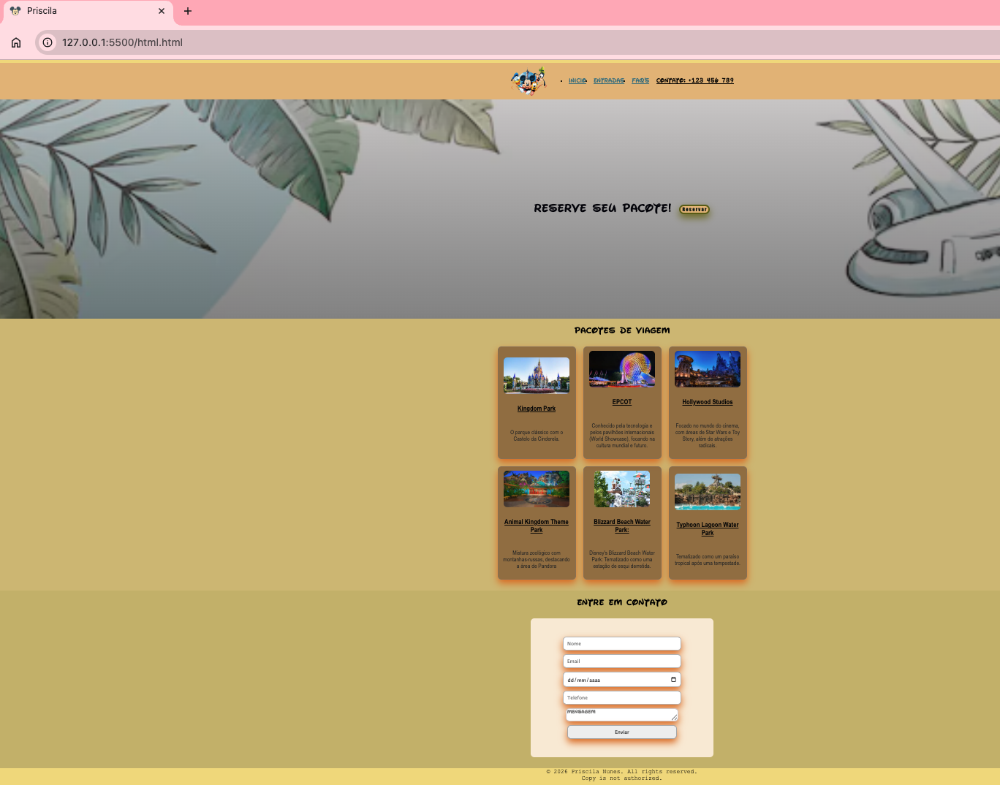

Pratica_css

Repositorio de práctica de HTML y CSS | HTML and CSS practice repository

Creado el 13/03/2026 | Created on 03/13/2026

📚 ¿Qué practiqué aquí? | What did I practice here?

✅ Práctica de HTML (estructura básica, < div >...) | HTML practice (basic structure, < div >...)  
✅ Práctica de CSS (botones animados, clases...) | CSS practice (animated buttons, classes...)  
✅ Cambios de información general de la página (icono y nombre de pestaña) | General page info changes (tab icon and name)  
✅ Importación y uso de fuentes personalizadas | Importing and using custom fonts  
✅ Separación y personalización de secciones | Separating and customizing sections  
✅ @media / diseño responsive para adaptarse al móvil | @media / responsive design for mobile  
✅ Principios básicos de lógica | Basic logic principles  
✅ Cards con información y enlaces funcionales | Cards with information and working links  

🖼️ Preview

🌱 Aprendiendo paso a paso | Learning step by step

